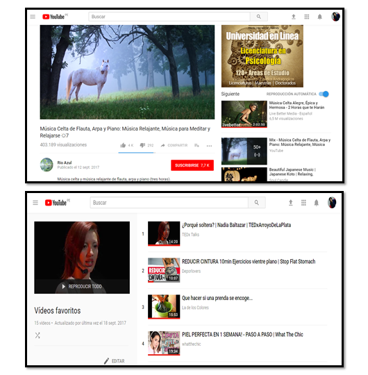
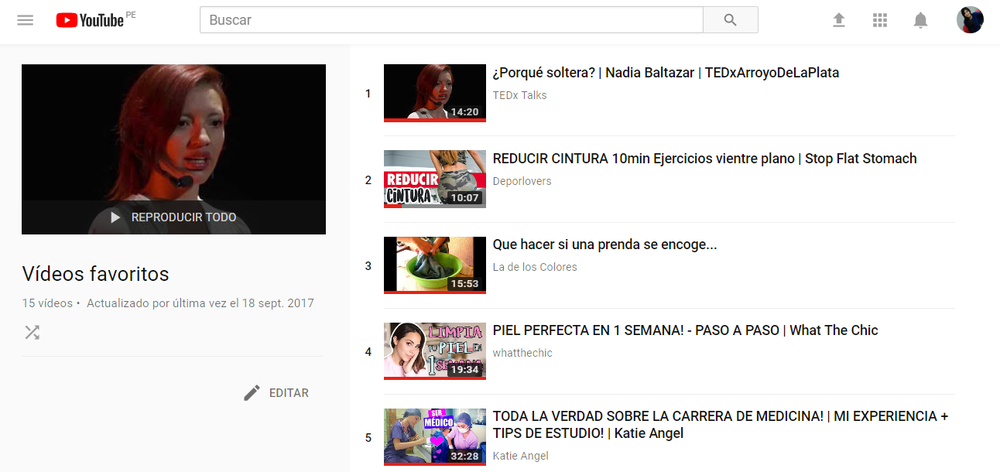

# Youtube 

## Objetivo

- El objetivo de este reto es identificar y explicar qué partes conforman el UX y qué partes el UI.

## Partes UX 

- Las partes que conforman el UX, tienen que ver con toda la experiencia que vive una persona al usar la web de Youtube, por ejemplo:
    - Poder parar el video y verlo en cualquier momento y en otros dispositivos.
    - Ver los videos las veces que quiera y tenerlos en mis favoritos.
    - Sugerencia de videos relacionados a mi historial.
    - Ser un canal abierto al publico y que me permita dar opinion en los comentarios.
    - Ver los canales en el que estoy suscrita.
    - Permitirme dar like y apoyar los videos de mis artistas favoritos o youtubers favoritos.
    - Permiterme compartir mis videos favoritos con mis amistades.
    - Compartir videos de mi auditoria, para compartir y difundir los temas que me interesen e  interesen a otras personas.
    - Escuchar un mix de canciones de acuerdo al genero que quiero.
    - Poder buscar rapidamente el video que quiero.
    - Manejar el tamaño de la pantalla segun mi comodidad.
    - Poder ver el nombre del video, artista y persona que lo subio, así como el numero de visualizaciones y la fecha en que lo subieron.
    - Tener subtitulos en algunos videos.
    - Permitirme mover los subtitulos donde mejor me parezca y así tener mayor comodidad.

### Imagen de referencia

## Partes UI

- Las partes que conforman el UI, tienen que ver con los componentes necesarios y requeridos por los usuarios, por ejemplo:
    - Diseño de botones.
    - Diseño de menús.
    - Colores de la marca (rojo y blanco).
    - Barra de play con botones para subtitulos, episodios, volumen.
    - Barra de avance en el consumo del contenido de un video.
    - Diseño de los titulos y subitulos del video.
    - La forma, tamaño y colores de los covers de los videos.
    - El Cambiar de color de los iconos segun donde estemos ubicados.

### Imagen de referencia

